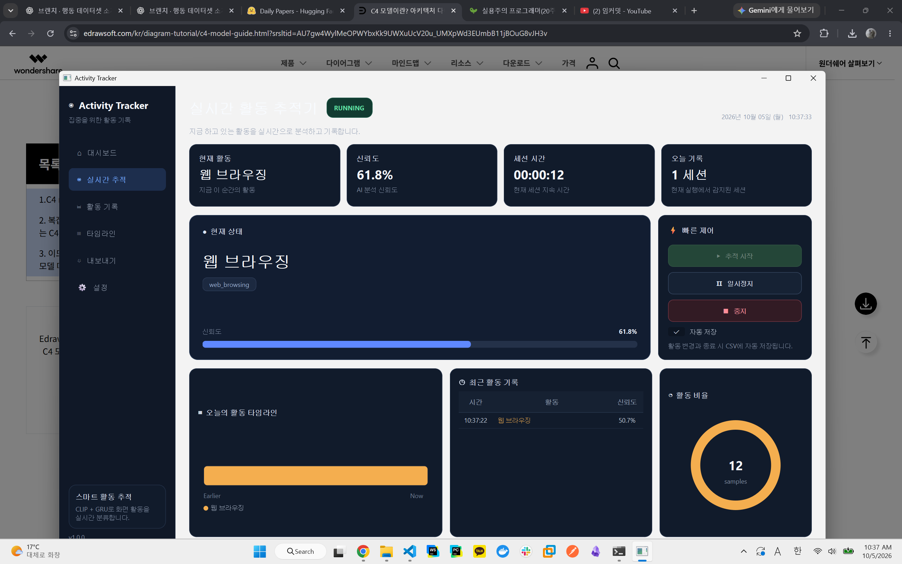
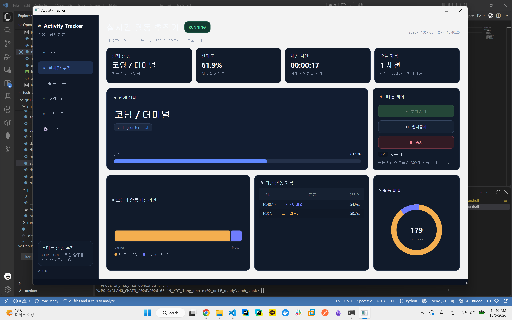
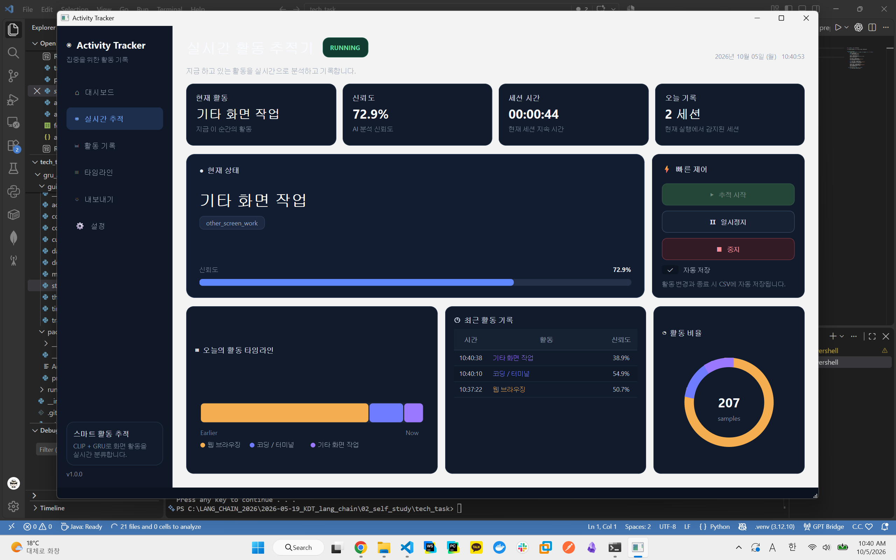

# PC Activity Tracker

Windows 화면의 **시간적 흐름**을 바탕으로 현재 작업 활동을 자동 분류하고 기록하는 실험 프로젝트입니다.

[프로젝트 문서 보기 (Notion)](https://app.notion.com/p/3ef117a41d4d808dadbcf91fce5bc9d8)

<p align="center">
  
  
  
</p>

## 주요 기능

- Windows 화면 실시간 캡처
- CLIP 기반 화면 이미지 embedding
- GRU 기반 시간적 맥락 추론
- CLIP text embedding과 비교해 activity label 예측
- 활동 변경 시 CSV 세션 기록
- PySide6 GUI에서 현재 활동, 신뢰도, 타임라인, 최근 기록 표시
- PyInstaller 기반 Windows EXE / ZIP 배포

## 모델 구조

현재 모델은 **CLIP + GRU** 구조를 사용합니다.

- **CLIP Image Encoder**: 화면을 512차원 embedding으로 변환
- **GRU**: 연속된 화면 embedding의 시간적 맥락 학습
- **Projection Layer**: GRU 출력을 CLIP text space로 투영
- **CLIP Text Encoder**: activity label prompt를 text embedding으로 변환
- **Prediction**: projected GRU output과 text embeddings의 cosine similarity를 비교해 최종 activity 선택

## 진행 과정

1. **PC 사용 정보 수집**
   - `active_window_tracker.py`: foreground 창 / 프로세스 세션 기록
   - `activity_collector.py`: 창 정보와 CPU / RAM 사용량 수집
   - `screen_capture.py`: Windows 화면 캡처

2. **이미지 기반 활동 분류 실험**
   - `clip_activity_classifier.py`: CLIP zero-shot 기반 활동 분류
   - `xclip_activity_tracker/`: X-CLIP 기반 시간축 분류 실험

3. **현재 구현**
   - `gru_activity_tracker/`: CLIP frame embedding + GRU temporal model
   - PIE2F-LongHorizon 기반 학습
   - 실시간 stateful GRU inference
   - PySide6 GUI
   - PyInstaller Windows 배포

## 프로젝트 구조

```text
.
├─ active_window_tracker.py
├─ activity_collector.py
├─ screen_capture.py
├─ clip_activity_classifier.py
├─ xclip_activity_tracker/
└─ gru_activity_tracker/
   ├─ gui/             # PySide6 UI
   ├─ runtime/         # CLIP + GRU 실시간 추론
   ├─ packaging/       # PyInstaller 설정
   ├─ train.py         # GRU 학습
   ├─ prepare_pie2f.py # PIE2F 전처리
   └─ build_and_run.bat
```

## 실행

> 빠른 사용을 원하면 우측 사이드바의 Release를 참고해주세요!

GUI를 소스에서 실행:

```powershell
python -m gru_activity_tracker.app
```

Windows 배포본 빌드 후 실행:

```powershell
.\gru_activity_tracker\build_and_run.bat
```

빌드 결과:

```text
dist/ActivityTracker/ActivityTracker.exe
dist/ActivityTracker-windows.zip
```

활동 기록 CSV는 기본적으로 다음 위치에 저장됩니다.

```text
%LOCALAPPDATA%\GRUActivityTracker\gru_activity_log.csv
```

## 문서

브레인스토밍, 설계 의사결정, 단위 테스트, 시행착오, 개발 과정, 데이터/모델 구조는 Notion에 정리하고 있습니다.

**Notion:** https://app.notion.com/p/3ef117a41d4d808dadbcf91fce5bc9d8
